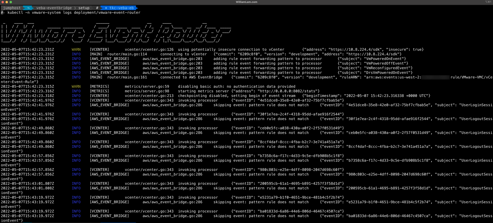

# Deploy VMware Event Router on VMware Cloud on AWS using AWS EventBridge

## Pre-Req:
* AWS EventBridge Bus and Rule already pre-created (including Access/Secret Key)
* Tanzu Kubernetes Grid (TKG) Cluster already deployed (see [tkc.yaml](tkc.yaml) for a minimal TKC configuration)

## Deployment

Step 1 - Disable PSP

```console
kubectl apply -f disable_psp.yaml
```

Step 2 - Create `vmware-system` namespace

```console
kubectl create ns vmware-system
```

Step 3 - Edit the [event-router-config.yaml](event-router-config.yaml) configuration with your VMware Cloud on AWS environment values such as the vCenter Server IP/hostname, credential and AWS EventBridge values.


Step 4 - Create the `event-router-config` secret

```console
kubectl -n vmware-system create secret generic event-router-config --from-file=event-router-config.yaml
```

Step 5 - Finally, instantiate the VMware Event Router

```console
kubectl -n vmware-system apply -f event-router-k8s.yaml
```

## Verification

```
kubectl-n vmware-system logs deployment/vmware-event-router
```

