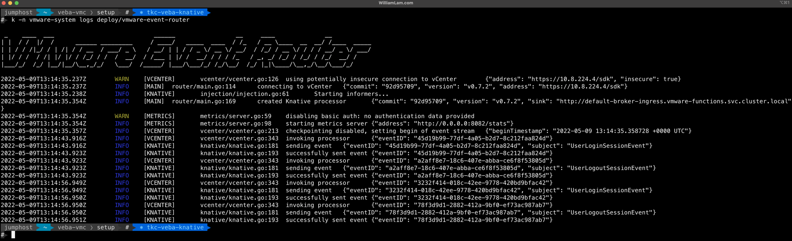

# Deploy VMware Event Router on VMware Cloud on AWS using Knative

## Pre-Req:
* Tanzu Kubernetes Grid (TKG) Cluster already deployed (see [tkc.yaml](tkc.yaml) for a minimal TKC configuration)
* [ytt](https://carvel.dev/ytt/docs/v0.40.0/install/) already installed

Step 1 - Disable PSP

```console
kubectl apply -f disable_psp.yaml
```

Step 2 - Run the `setup.sh` script which will download and setup all the required components for deploying the VMware Event Router

```console
chmod +x setup.sh
./setup.sh
```

Step 3 - Edit the [event-router-config.yaml](event-router-config.yaml) configuration with your specific VMware Cloud on AWS environment values such as vCenter Server IP/hostname and credential


Step 4 - Create the `event-router-config` secret

```console
kubectl -n vmware-system create secret generic event-router-config --from-file=event-router-config.yaml
```

Step 5 - Finally, instantiate the VMware Event Router

```console
kubectl -n vmware-system apply -f event-router-k8s.yaml
```

## Verification

```
kubectl-n vmware-system logs deployment/vmware-event-router
```



> **Note:** At this point, you are now ready to deploy [VEBA functions](https://github.com/vmware-samples/vcenter-event-broker-appliance/tree/development/examples/knative)